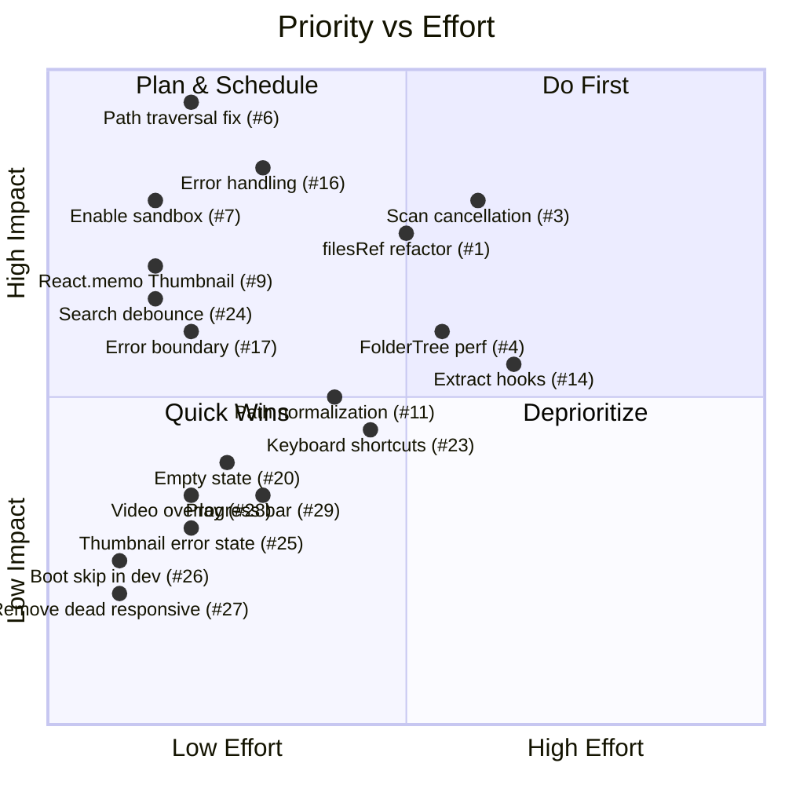

# Wiergise Media Scanner — Codebase Review

> Full review of the Electron + React + Vite media scanner application.  
> Covers **bugs & correctness**, **security**, **performance**, **architecture**, and **UI/UX**.

---

## Overview

Wiergise is an Electron desktop app that scans local directories for media files (images & videos), displays them in a virtualized grid with a folder tree, search, and grouping. It uses a "NERV tactical" sci-fi aesthetic with sound effects, hex-grid overlays, and a boot sequence animation.

### Stack
| Layer | Tech |
|---|---|
| Desktop shell | Electron 33 |
| Renderer | React 18 + TailwindCSS v4 |
| Bundler | Vite 6 |
| Virtualisation | `@tanstack/react-virtual` |
| Language | TypeScript 5.7 |

---

## 🔴 Critical Issues (Bugs & Correctness)

### 1. `filesRef` mutations bypass React's render cycle

**Files:** [App.tsx](file:///C:/Users/Chef/orca/projects/Wiergise/src/renderer/App.tsx#L16-L17), [App.tsx](file:///C:/Users/Chef/orca/projects/Wiergise/src/renderer/App.tsx#L63-L65)

```typescript
const filesRef = useRef<MediaFile[]>([]);
const [filesVersion, setFilesVersion] = useState(0);
```

The pattern of mutating `filesRef.current` and then bumping a `filesVersion` counter is **fragile and error-prone**:

- Components reading `filesRef.current` directly (e.g., `SearchBar`, `FolderTree`) don't subscribe to `filesVersion`, so they get **stale data** until something else forces a re-render.
- The `useMemo` at [line 73](file:///C:/Users/Chef/orca/projects/Wiergise/src/renderer/App.tsx#L73) depends on `filesVersion` but the actual data is in `filesRef.current` — this creates a tight coupling between a ref (imperative) and a memo (declarative) that is easy to break during maintenance.
- `filesRef.current.push(...batch)` at [line 64](file:///C:/Users/Chef/orca/projects/Wiergise/src/renderer/App.tsx#L64) can cause **stack overflow** with very large batches if the spread operator exceeds the call stack limit (~100k arguments on V8).

**Recommendation:** Use `useState` with a functional updater (`setFiles(prev => [...prev, ...batch])`) or use `useReducer` for append-only accumulation. For the push-overflow concern, use `Array.prototype.concat` or a loop.

---

### 2. `media://` protocol path construction is incorrect on Windows

**File:** [preload.ts](file:///C:/Users/Chef/orca/projects/Wiergise/electron/preload.ts#L40)

```typescript
toMediaUrl: (filePath) => `media://${encodeURIComponent(filePath)}/`,
```

**File:** [main.ts](file:///C:/Users/Chef/orca/projects/Wiergise/electron/main.ts#L54-L57)

```typescript
const url = new URL(request.url);
const filePath = decodeURIComponent(url.host) + url.pathname;
return net.fetch(path.normalize(filePath));
```

The URL `media://C%3A%5CUsers%5C...` puts the entire Windows path into the **host** portion. The `new URL()` constructor will lowercase the host per the URL spec, so `C%3A` becomes `c%3a`, which decodes to `c:` — this may work on Windows (case-insensitive FS) but is brittle. More importantly, `url.pathname` appends a trailing `/` (the trailing slash in the template literal), producing paths like `C:\Users\path/`. On non-trivial paths with sub-directories, `url.pathname` may contain extra path segments.

**Recommendation:** Put the full encoded path in the pathname instead, e.g. `media://local/<encoded-path>`, and parse only `url.pathname` in the handler.

---

### 3. No scan cancellation mechanism

**Files:** [App.tsx](file:///C:/Users/Chef/orca/projects/Wiergise/src/renderer/App.tsx#L53-L70), [main.ts](file:///C:/Users/Chef/orca/projects/Wiergise/electron/main.ts#L92-L108)

If the user starts a scan on a massive directory (e.g., the entire home folder), there is **no way to cancel it**. The UI correctly disables the Scan button during a scan, but there's no "Stop" button. The scan runs to completion, pushing hundreds of IPC events.

If the user closes the window during a scan, `win.isDestroyed()` guards the sends, but the `scanFolderStream` async generator continues running to completion in the main process with no AbortController or cleanup.

**Recommendation:** Accept an `AbortSignal` in `scanFolderStream`, wire it to a "Cancel" button in the UI, and pass it via IPC.

---

### 4. FolderTree rebuilds on every `filesRef` mutation

**File:** [FolderTree.tsx](file:///C:/Users/Chef/orca/projects/Wiergise/src/renderer/components/FolderTree.tsx)

The `buildTree` function uses a `Map<string, RawNode>` for child lookup — which is good. However, its `useMemo` depends on `[files, rootPath]`, and `files` is `filesRef.current` (a mutable ref array). Since the ref identity never changes, the memo dependency is **identity-stable but content-unstable** — React will skip recalculation even when files are added. Conversely, when `filesVersion` triggers a re-render of `App`, the parent re-renders `FolderTree` with the same ref, and `useMemo` sees the same reference and skips.

The tree only rebuilds correctly because React's reconciliation re-renders the component anyway when props change at the parent level, but the `useMemo` cache may or may not invalidate depending on React's internal heuristics for ref identity.

With 100k+ media files, even O(n × d) tree construction on every batch arrival (during streaming scan) will cause visible jank.

**Recommendation:** Pass `filesVersion` as a prop to `FolderTree` and include it in the `useMemo` dependency array, or compute the tree in the parent and pass it down. Consider building the tree incrementally (append-only) rather than from scratch on each batch.

---

### 5. `scanFolderStream` never flushes during scan — only at the end

**File:** [scan.ts](file:///C:/Users/Chef/orca/projects/Wiergise/src/scanner/scan.ts#L116-L131)

```typescript
for (const f of files) {
  buffer.push(f);
  count++;
  if (buffer.length >= BATCH_SIZE) {
    onProgress?.({ count, currentDir });
  }
}
```

When `buffer.length >= BATCH_SIZE`, the code calls `onProgress` but **never calls `flush()`**. This means the `onBatch` callback is only ever called **once**, at the very end of the scan (line 133: `flush()`). The streaming architecture — designed to push incremental batches of ~250 files — is completely broken. The renderer will receive all files in one giant batch after the entire scan completes, defeating the purpose of the streaming design.

**Recommendation:** Call `flush()` inside the `if (buffer.length >= BATCH_SIZE)` block:

```typescript
if (buffer.length >= BATCH_SIZE) {
  flush();
  onProgress?.({ count, currentDir });
}
```

---

## 🟠 Security Issues

### 6. The `media://` protocol has no path validation

**File:** [main.ts](file:///C:/Users/Chef/orca/projects/Wiergise/electron/main.ts#L53-L58)

```typescript
protocol.handle("media", (request) => {
  const url = new URL(request.url);
  const filePath = decodeURIComponent(url.host) + url.pathname;
  return net.fetch(path.normalize(filePath));
});
```

Any content injected into the renderer (e.g., a maliciously named file like `../../etc/passwd`) could craft a `media://` URL that reads **arbitrary files** from the filesystem. `path.normalize` does not prevent path traversal — it actually resolves `..` segments.

**Recommendation:** Validate that the resolved path starts with the scanned folder root. Reject paths containing `..` after normalization.

---

### 7. `sandbox: false` in webPreferences

**File:** [main.ts](file:///C:/Users/Chef/orca/projects/Wiergise/electron/main.ts#L23)

```typescript
sandbox: false, // preload uses Node built-ins via contextBridge
```

The comment says the preload uses Node built-ins, but the only Node APIs used in the preload are `ipcRenderer` and `contextBridge` (Electron APIs, not Node). Disabling the sandbox is **unnecessary** and weakens the security model.

**Recommendation:** Enable `sandbox: true`. Electron's `contextBridge` and `ipcRenderer` work with the sandbox enabled since Electron 20+.

---

### 8. `nodeIntegration: false` but no CSP headers

**File:** [index.html](file:///C:/Users/Chef/orca/projects/Wiergise/index.html)

While `nodeIntegration` is correctly disabled, there is no Content Security Policy meta tag. For an Electron app, a CSP like `default-src 'self'; script-src 'self'; style-src 'self' 'unsafe-inline'` would harden the renderer against XSS.

---

## 🟡 Performance Issues

### 9. Virtualized grid rows re-render on every scroll due to missing memoization

**File:** [VirtualizedGrid.tsx](file:///C:/Users/Chef/orca/projects/Wiergise/src/renderer/components/VirtualizedGrid.tsx)

The grid uses `@tanstack/react-virtual` for row virtualization, which is good. However:

- The `Thumbnail` component is not wrapped in `React.memo` — meaning every thumbnail in every visible row re-renders whenever the parent grid re-renders (e.g., on scroll, on filter change, etc.).
- The `groupHeaders` lookup inside the render loop does a linear scan (`findLast`) through all headers for every row.

**Recommendation:** 
- Wrap `Thumbnail` in `React.memo`.
- Pre-compute a `Map<rowIndex, GroupHeader>` or binary-search the sorted headers array instead of `findLast`.

---

### 10. `new Date()` called repeatedly inside hot render paths

**File:** [App.tsx](file:///C:/Users/Chef/orca/projects/Wiergise/src/renderer/App.tsx#L108-L146)

The date-grouping logic creates `new Date(f.birthtime)` for every file, then calls `.getTime()`, `.getFullYear()`, `.getMonth()`, `.getDate()`, and `.toLocaleDateString()`. For 100k files, this is a significant cost.

**Recommendation:** Parse dates once during scanning (store as epoch numbers in `MediaFile`), and use a pre-computed date key field.

---

### 11. Path normalization in filter loop runs for every file on every keystroke

**File:** [App.tsx](file:///C:/Users/Chef/orca/projects/Wiergise/src/renderer/App.tsx#L78-L84)

```typescript
const normFp = f.filePath.replace(/\\/g, "/").toLowerCase();
```

This runs `.replace()` and `.toLowerCase()` on every single file path on every re-render. With 100k files, this creates 100k temporary strings on every keystroke.

**Recommendation:** Normalize paths once (during scan), and store the normalized version in the `MediaFile` object (or a lookup table).

---

### 12. HexGridOverlay renders on every parent re-render

**File:** [HexGridOverlay.tsx](file:///C:/Users/Chef/orca/projects/Wiergise/src/renderer/components/HexGridOverlay.tsx)

This purely decorative SVG overlay is a function component with no memoization. It re-renders on every App state change even though its output never changes.

**Recommendation:** Wrap in `React.memo(() => ...)` since it has no props.

---

### 13. SoundManager uses `AudioContext` but never closes it

**File:** [SoundManager.ts](file:///C:/Users/Chef/orca/projects/Wiergise/src/renderer/sfx/SoundManager.ts)

The `AudioContext` is created on first use but never `.close()`'d. While this is fine for an Electron app (single lifecycle), it's poor practice and would be a leak in a web context.

---

## 🔵 Architecture & Code Quality

### 14. App.tsx is a 323-line monolith

**File:** [App.tsx](file:///C:/Users/Chef/orca/projects/Wiergise/src/renderer/App.tsx)

All state management, filtering, grouping, and layout logic lives in a single component. This makes the component hard to test and reason about.

**Recommendation:** Extract:
- A `useScanState()` custom hook for scan lifecycle (status, folder, progress, files).
- A `useFilteredFiles(files, searchQuery, selectedFolder, groupMode)` hook for the derived data pipeline.
- Keep App.tsx as a thin shell that wires hooks to components.

---

### 15. Mixed use of Tailwind classes and CSS files

**Files:** All component `.css` files ([FolderTree.css](file:///C:/Users/Chef/orca/projects/Wiergise/src/renderer/components/FolderTree.css), [VirtualizedGrid.css](file:///C:/Users/Chef/orca/projects/Wiergise/src/renderer/components/VirtualizedGrid.css), etc.) alongside Tailwind classes in JSX.

Some CSS files contain only a few lines (e.g., [GroupControls.css](file:///C:/Users/Chef/orca/projects/Wiergise/src/renderer/components/GroupControls.css) is 65 bytes, [SearchBar.css](file:///C:/Users/Chef/orca/projects/Wiergise/src/renderer/components/SearchBar.css) is 61 bytes, [Thumbnail.css](file:///C:/Users/Chef/orca/projects/Wiergise/src/renderer/components/Thumbnail.css) is 63 bytes). These tiny CSS files only exist to override autofill/outline styles that could be handled with Tailwind utilities.

**Recommendation:** Either commit fully to Tailwind (use `@apply` or utilities for all styles) or commit to CSS modules. The current hybrid approach increases cognitive load.

---

### 16. No error handling anywhere in the renderer

**Files:** [App.tsx](file:///C:/Users/Chef/orca/projects/Wiergise/src/renderer/App.tsx#L53-L70)

The `startScan` callback has no `try/catch`. If `window.scanAPI.startScan()` rejects (e.g., folder deleted between pick and scan, permissions error), the app will show an unhandled promise rejection and remain stuck in "scanning" status forever.

**Recommendation:** Add error handling with a user-visible error state/message.

---

### 17. No error boundary in the React tree

**File:** [main.tsx](file:///C:/Users/Chef/orca/projects/Wiergise/src/renderer/main.tsx)

```typescript
createRoot(document.getElementById("root")!).render(
  <React.StrictMode>
    <App />
  </React.StrictMode>,
);
```

A crash in any component (e.g., from malformed file metadata) will white-screen the entire app with no recovery.

**Recommendation:** Add a React error boundary wrapping `<App />`.

---

### 18. Scanner runs in Electron main process — blocks window responsiveness

**File:** [scan.ts](file:///C:/Users/Chef/orca/projects/Wiergise/src/scanner/scan.ts)

The scanner correctly uses `fs.promises` (async I/O) with a bounded concurrency pool — good. However, it still runs in the Electron **main process** rather than a worker thread. While the I/O is non-blocking, the CPU work of processing directory listings, building paths, and pushing results still runs on the main thread. For very large trees (100k+ files), the accumulated micro-blocking can degrade window responsiveness (e.g., menus, window dragging).

**Recommendation:** Move the scanner to a Node `worker_threads` worker or Electron's `utilityProcess` to fully decouple heavy scanning from the main process event loop.

---

### 19. No `@types/electron` in devDependencies

**File:** [package.json](file:///C:/Users/Chef/orca/projects/Wiergise/package.json)

While `electron` itself bundles basic types, the project doesn't explicitly depend on `@types/electron` or have Electron-specific type augmentations. The `tsconfig.node.json` correctly specifies `"types": ["node"]` which is good. Consider adding explicit `@types/electron` for better IDE support, or verify the bundled types are sufficient.

---

## 🟣 UI/UX Improvements

### 20. No loading skeleton or placeholder in the grid

**File:** [VirtualizedGrid.tsx](file:///C:/Users/Chef/orca/projects/Wiergise/src/renderer/components/VirtualizedGrid.tsx)

When scanning, the grid shows items as they stream in, but there's no skeleton/shimmer effect for items that are still loading. When no files are found, there's no empty state illustration — just a blank area.

**Recommendation:** Add:
- An empty-state component ("No media files found" with an illustration) for `files.length === 0 && status === 'done'`.
- A skeleton shimmer during active scanning.

---

### 21. No feedback when folder selection returns `null`

**File:** [App.tsx](file:///C:/Users/Chef/orca/projects/Wiergise/src/renderer/App.tsx#L44-L51)

If the user opens the folder picker and cancels, the UI does nothing — no toast, no visual feedback. The click sound plays but nothing else happens. This could confuse users who accidentally click "Select folder".

---

### 22. Folder tree has no expand/collapse all functionality

**File:** [FolderTree.tsx](file:///C:/Users/Chef/orca/projects/Wiergise/src/renderer/components/FolderTree.tsx)

For large directory trees, there's no "Expand All" / "Collapse All" button. Users must manually click through each folder.

---

### 23. No keyboard shortcuts

There are no keyboard shortcuts for common actions:
- `Ctrl+O` for folder selection
- `Ctrl+F` for search focus
- `Escape` to clear search / deselect folder
- `Ctrl+Enter` to start scan

---

### 24. Search has no debounce

**File:** [SearchBar.tsx](file:///C:/Users/Chef/orca/projects/Wiergise/src/renderer/components/SearchBar.tsx)

The search input calls `onChange` (which is `setSearchQuery`) on every keystroke. Combined with the expensive filtering in `useMemo` (see issue #11), this can cause stuttering on large datasets.

**Recommendation:** Add a 150-250ms debounce on the search input.

---

### 25. Thumbnails don't handle loading/error states

**File:** [Thumbnail.tsx](file:///C:/Users/Chef/orca/projects/Wiergise/src/renderer/components/Thumbnail.tsx)

If a thumbnail fails to load (e.g., corrupt image, permission denied), there's no error fallback. The `` tag will show a broken image icon, breaking the visual grid.

**Recommendation:** Add `onError` handler to show a fallback placeholder, and `onLoad` to transition from a loading skeleton.

---

### 26. BootSequence animation blocks interaction for 600ms

**File:** [BootSequence.tsx](file:///C:/Users/Chef/orca/projects/Wiergise/src/renderer/components/BootSequence.tsx)

The boot sequence renders a full-screen overlay for 600ms on every app mount. While aesthetically cool, it delays time-to-interactive. In development, this runs on every HMR reload, which is annoying.

**Recommendation:** Skip the boot animation in dev mode (`import.meta.env.DEV`), and consider making it shorter (300ms) or dismissible.

---

### 27. No responsive design below 800px

**File:** [App.tsx](file:///C:/Users/Chef/orca/projects/Wiergise/src/renderer/App.tsx#L196)

```typescript
<div className="flex flex-col sm:flex-row h-screen ...">
```

The `sm:` breakpoint applies at 640px, but the Electron window `minWidth` is 800px. So the `flex-col` layout for mobile/small screens can never actually trigger. The responsive classes are dead code.

**Recommendation:** Either lower `minWidth` to allow the responsive layout, or remove the `sm:` breakpoint classes and use the desktop layout exclusively (since this is a desktop app).

---

### 28. Thumbnail `useSfx` hook is called for every visible thumbnail

**File:** [Thumbnail.tsx](file:///C:/Users/Chef/orca/projects/Wiergise/src/renderer/components/Thumbnail.tsx#L15)

```typescript
const { playHover } = useSfx();
```

Every `Thumbnail` instance calls `useSfx()`. While the hook returns a stable frozen object (good), the hook call itself is still overhead multiplied by every visible thumbnail. With 50+ visible thumbnails, this is 50+ hook calls per render cycle. The `playHover` callback should be passed as a prop from the parent `VirtualizedGrid` instead.

---

### 29. Scan progress has no progress bar

**File:** [App.tsx](file:///C:/Users/Chef/orca/projects/Wiergise/src/renderer/App.tsx#L278-L291)

During scanning, the UI shows a text counter ("X files found so far") and the current directory. But there's no **progress bar** because the total file count isn't known upfront. Even an indeterminate/pulsing progress bar would improve the UX.

---

## ⚪ Minor / Housekeeping

| # | File | Issue |
|---|---|---|
| 30 | [package.json](file:///C:/Users/Chef/orca/projects/Wiergise/package.json) | No `"type": "module"` field despite using ESM imports everywhere (the node tsconfig uses CommonJS, so this is intentional, but should be documented) |
| 31 | [index.html](file:///C:/Users/Chef/orca/projects/Wiergise/index.html) | Missing `<meta name="description">` and favicon |
| 32 | [theme.css](file:///C:/Users/Chef/orca/projects/Wiergise/src/renderer/theme.css) | Custom properties defined but some are duplicated or unused |
| 33 | [App.css](file:///C:/Users/Chef/orca/projects/Wiergise/src/renderer/App.css) | Contains `.app-container` class that is never used — App.tsx uses Tailwind classes directly |
| 34 | [SoundManager.ts](file:///C:/Users/Chef/orca/projects/Wiergise/src/renderer/sfx/SoundManager.ts) | `SfxConfig` allows setting audio URLs but `useSfx` hook never calls `setConfig()` — no sound files are ever loaded, so all SFX is silently no-op |
| 35 | [extensions.ts](file:///C:/Users/Chef/orca/projects/Wiergise/src/scanner/extensions.ts) | `.webp` is listed as image-only, but animated WebP is effectively video — consider supporting both |
| 36 | All components | No unit tests exist anywhere in the project |

---

## Summary & Priority Matrix



### Top 5 Priorities (Do These First)

1. **🔴 Security: Fix media:// path traversal** (#6) — Low effort, critical security fix
2. **🔴 Security: Enable sandbox** (#7) — One-line change, significant security improvement
3. **🔴 Bug: Add error handling to scan** (#16) — App can get stuck without this
4. **🟡 Performance: `React.memo` on Thumbnail** (#9) — Easy win, big perf impact
5. **🟡 UX: Add search debounce** (#24) — Small change, prevents input lag

---

*Review generated for the Wiergise Media Scanner codebase. 36 items identified across security, correctness, performance, architecture, and UX.*
