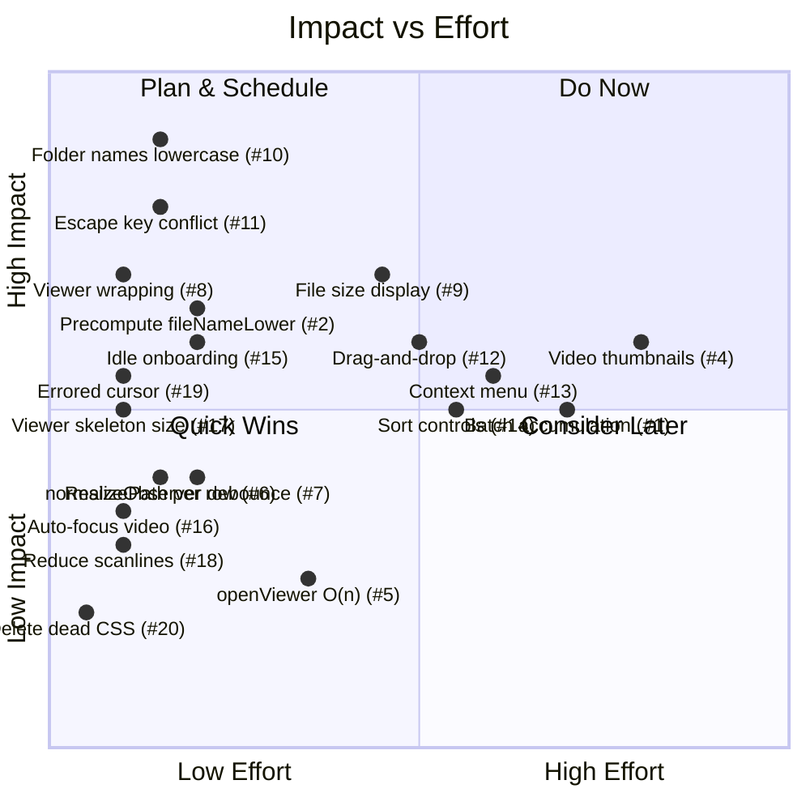

# Wiergise Media Scanner — v3 Review: UI/UX & Optimizations

> Third review focused exclusively on **UI/UX improvements** and **performance optimizations**.  
> All critical bugs from v1 and v2 are confirmed fixed. This review targets polish and speed.

---

## v2 Fixes Confirmed ✅

| v2 Issue | Status |
|---|---|
| #1 `pathToFileUrl` triple-slash | ✅ Fixed in [main.ts:173-176](file:///C:/Users/Chef/orca/projects/Wiergise/electron/main.ts#L173-L176) |
| #2 pathname leading slash | ✅ Stripped in [main.ts:139](file:///C:/Users/Chef/orca/projects/Wiergise/electron/main.ts#L139) |
| #3 No image viewer | ✅ [MediaViewer.tsx](file:///C:/Users/Chef/orca/projects/Wiergise/src/renderer/components/MediaViewer.tsx) added |
| #4 scanWorker never exits | ✅ `process.exit(0)` in [scanWorker.ts:54](file:///C:/Users/Chef/orca/projects/Wiergise/electron/scanWorker.ts#L54) |
| #5 onCancelled never called | ✅ Called in [App.tsx:91](file:///C:/Users/Chef/orca/projects/Wiergise/src/renderer/App.tsx#L91) |
| #6 onHover not passed | ✅ Plumbed through [VirtualizedGrid.tsx:225](file:///C:/Users/Chef/orca/projects/Wiergise/src/renderer/components/VirtualizedGrid.tsx#L225) |
| #7 indexHeaders dead code | ✅ Removed |
| #8 ErrorBoundary type | ✅ Now uses `ErrorInfo` in [ErrorBoundary.tsx:28](file:///C:/Users/Chef/orca/projects/Wiergise/src/renderer/components/ErrorBoundary.tsx#L28) |
| #10 FolderTree normalization | ✅ Now lowercases in [FolderTree.tsx:36](file:///C:/Users/Chef/orca/projects/Wiergise/src/renderer/components/FolderTree.tsx#L36) |
| #13 expandedPaths stale | ✅ `useEffect` added in [FolderTree.tsx:268-274](file:///C:/Users/Chef/orca/projects/Wiergise/src/renderer/components/FolderTree.tsx#L268-L274) |

---

## 🟡 Performance Optimizations

### 1. `concat` creates a brand-new O(n) array on every batch — grows quadratically

**File:** [useScanState.ts](file:///C:/Users/Chef/orca/projects/Wiergise/src/renderer/hooks/useScanState.ts#L51)

```typescript
return { ...state, files: state.files.concat(action.files) };
```

Each `concat` copies all previously accumulated files plus the new batch into a fresh array. Over a 100k-file scan with 400 batches of 250 files:
- Batch 1: copies 250 items
- Batch 2: copies 500 items  
- Batch 400: copies 100,000 items

Total copies: ~250 + 500 + ... + 100,000 = ~20 million element copies. This creates significant GC pressure — each intermediate array (250, 500, ..., 99,750 items) becomes garbage.

**Recommendation:** Use an **immutable list** structure (e.g., a simple wrapper that stores batches as a list-of-lists and provides a flat iterator), or accept the trade-off and document it. Alternatively, use `[...state.files, ...action.files]` which has the same cost but makes the immutability intent clearer — or switch to a `useRef` for the file array + a version counter (the original design) but wrap it in a proper hook that manages both atomically.

A pragmatic middle ground: accumulate batches as `MediaFile[][]` and flatten lazily:

```typescript
case "batch":
  return { ...state, batches: [...state.batches, action.files] };
// Expose a computed `files` getter that flattens once, then caches.
```

---

### 2. `fileName.toLowerCase()` runs on every file during search filtering

**File:** [App.tsx](file:///C:/Users/Chef/orca/projects/Wiergise/src/renderer/App.tsx#L182-L184)

```typescript
searchFiltered = folderFiltered.filter((f) =>
  f.fileName.toLowerCase().includes(q),
);
```

`fileName.toLowerCase()` is called for every file on every debounced keystroke. With 100k files and a 200ms debounce, that's 100k string allocations per query change.

**Recommendation:** Precompute `fileNameLower` in the scanner alongside `normPath`:

```typescript
// In scan.ts collectDirectory:
fileNameLower: c.name.toLowerCase(),
```

Then use `f.fileNameLower.includes(q)` — zero allocations per filter pass.

---

### 3. `virtualRows` array is rebuilt on every filter change, even when columns haven't changed

**File:** [VirtualizedGrid.tsx](file:///C:/Users/Chef/orca/projects/Wiergise/src/renderer/components/VirtualizedGrid.tsx#L101-L144)

The `virtualRows` memo depends on `[files, groupHeaders, columns]`. When the search filter changes, `files` changes (new array from the filter), so `virtualRows` is fully rebuilt — creating N/columns `VirtualRow` objects each with a `files.slice()` array.

This is inherent to the architecture and not easily avoided, but the **row key** computation can be optimized. Currently:

```typescript
key: `row-${i}-${rowFiles[0]?.filePath || i}`,
```

Using `filePath` as part of the key forces React to unmount/remount thumbnails when the file at a given row position changes (e.g., when a filter removes a file, every subsequent row shifts). A simple index-based key `row-${i}` would allow React to **update** existing DOM instead of tearing it down.

**However**, index-based keys have a well-known pitfall with stateful children (`loaded`/`errored` in `Thumbnail`). The current approach is **correct** for correctness, but has a cost. No change recommended — just documenting the trade-off.

---

### 4. No image caching — scrolling up reloads thumbnails from disk

**File:** [Thumbnail.tsx](file:///C:/Users/Chef/orca/projects/Wiergise/src/renderer/components/Thumbnail.tsx)

When the user scrolls down and then back up, the virtualized grid unmounts and remounts thumbnails. Each remount creates a fresh `` element, which triggers a new `media://` fetch from disk. While the OS file cache helps, Chromium's internal image cache may or may not retain these depending on memory pressure.

For videos (which use `preload="metadata"`), each remount also re-fetches the first frame, which involves I/O + decoder warmup.

**Recommendation:**
- Increase `overscan` from 4 to 6-8 rows to keep more offscreen rows alive.
- For videos, consider generating actual thumbnails (extracted frames as JPEG) during the scan instead of loading the full video source for every thumbnail.

---

### 5. `openViewer` uses `findIndex` O(n) on every click

**File:** [App.tsx](file:///C:/Users/Chef/orca/projects/Wiergise/src/renderer/App.tsx#L260-L263)

```typescript
const openViewer = useCallback((file: MediaFile) => {
  const idx = derivedFiles.findIndex((f) => f.filePath === file.filePath);
  setViewerIndex(idx >= 0 ? idx : 0);
}, [derivedFiles]);
```

With 100k files, `findIndex` is O(n). This runs on every thumbnail click.

**Recommendation:** Pass the file index from the grid instead of searching for it:

```typescript
// In VirtualizedGrid, pass the absolute index:
onClick={(file, idx) => onThumbnailClick?.(file, idx)}
```

---

### 6. FolderTree `normalizePath(selectedFolder)` runs on every `TreeNodeRow` render

**File:** [FolderTree.tsx](file:///C:/Users/Chef/orca/projects/Wiergise/src/renderer/components/FolderTree.tsx#L64-L65)

```typescript
const isSelected =
  selectedFolder !== null && normalizePath(selectedFolder) === node.normPath;
```

Every `TreeNodeRow` calls `normalizePath(selectedFolder)` during render. With 500+ folders visible, that's 500+ calls of the same function with the same input.

**Recommendation:** Precompute `normalizePath(selectedFolder)` once in the parent `FolderTree` component and pass it as a prop:

```typescript
const normSelectedFolder = useMemo(
  () => selectedFolder ? normalizePath(selectedFolder) : null,
  [selectedFolder],
);
```

---

### 7. `ResizeObserver` callback triggers `setState` without debouncing

**File:** [VirtualizedGrid.tsx](file:///C:/Users/Chef/orca/projects/Wiergise/src/renderer/components/VirtualizedGrid.tsx#L57-L66)

```typescript
const observer = new ResizeObserver((entries) => {
  for (const entry of entries) {
    if (entry.contentRect && entry.contentRect.width > 0) {
      setContainerWidth(entry.contentRect.width);
    }
  }
});
```

During a window resize (drag), `ResizeObserver` fires at the browser's frame rate (~60fps). Each call triggers a `setState` → re-render → `virtualRows` rebuild → virtualizer re-measure. This can cause jank during resize.

**Recommendation:** Debounce or throttle the width update:

```typescript
const observer = new ResizeObserver((entries) => {
  for (const entry of entries) {
    if (entry.contentRect?.width > 0) {
      requestAnimationFrame(() => setContainerWidth(entry.contentRect.width));
    }
  }
});
```

Or better, use `requestAnimationFrame` + a ref to batch:

```typescript
let raf: number;
const observer = new ResizeObserver((entries) => {
  cancelAnimationFrame(raf);
  raf = requestAnimationFrame(() => {
    const w = entries[0]?.contentRect?.width;
    if (w && w > 0) setContainerWidth(w);
  });
});
```

---

## 🟣 UI/UX Improvements

### 8. MediaViewer wrapping doesn't stop at boundaries

**File:** [App.tsx](file:///C:/Users/Chef/orca/projects/Wiergise/src/renderer/App.tsx#L265-L276)

```typescript
if (direction === "prev") {
  return (prev - 1 + derivedFiles.length) % derivedFiles.length;
}
return (prev + 1) % derivedFiles.length;
```

Navigation wraps around: going "previous" from the first file jumps to the last, and vice versa. This is disorienting in a file browser context where the user expects the arrows to disappear at the boundaries.

**File:** [MediaViewer.tsx](file:///C:/Users/Chef/orca/projects/Wiergise/src/renderer/components/MediaViewer.tsx#L48-L49) partially handles this:

```typescript
const hasPrev = currentIndex > 0;
const hasNext = total > 0 && currentIndex < total - 1;
```

The buttons correctly hide at boundaries, but **keyboard arrows still wrap**. Pressing ← on the first image jumps to the last.

**Fix:** Guard the `navigateViewer` callback:

```typescript
if (direction === "prev" && prev > 0) return prev - 1;
if (direction === "next" && prev < derivedFiles.length - 1) return prev + 1;
return prev;
```

---

### 9. No file size displayed anywhere

Neither `Thumbnail` nor `MediaViewer` shows the file size. For a media scanner, file size is critical information — it helps users identify large videos, duplicate files, etc.

**Recommendation:** Add `sizeBytes: number` to `MediaFile` (from `stat.size` in the scanner), and display it in:
- The MediaViewer metadata bar (formatted: "4.2 MB")
- Optionally on thumbnail hover tooltip

---

### 10. FolderTree node names show lowercase (regression from normalization fix)

**File:** [FolderTree.tsx](file:///C:/Users/Chef/orca/projects/Wiergise/src/renderer/components/FolderTree.tsx#L39-L44)

```typescript
function getBasename(p: string): string {
  const norm = normalizePath(p);  // ← lowercases!
  const parts = norm.split("/").filter(Boolean);
  return parts.length > 0 ? parts[parts.length - 1] : p;
}
```

After adding `.toLowerCase()` to `normalizePath`, `getBasename` now returns lowercase names. A folder originally named `Photos` displays as `photos` in the tree. This is a visual regression.

**Fix:** `getBasename` should use raw path splitting without lowercasing:

```typescript
function getBasename(p: string): string {
  if (!p) return "";
  const parts = p.replace(/\\/g, "/").split("/").filter(Boolean);
  return parts.length > 0 ? parts[parts.length - 1] : p;
}
```

Similarly, the tree node `name` field is set from `seg` which comes from the lowercased `normDir` split. Node names should preserve original casing for display.

---

### 11. Escape key conflict: MediaViewer vs SearchBar vs FolderSelection

**File:** [App.tsx](file:///C:/Users/Chef/orca/projects/Wiergise/src/renderer/App.tsx#L150-L156) and [MediaViewer.tsx](file:///C:/Users/Chef/orca/projects/Wiergise/src/renderer/components/MediaViewer.tsx#L63-L64)

Both `App` and `MediaViewer` listen for Escape. When the viewer is open and the user presses Escape:
1. MediaViewer's handler fires → closes the viewer
2. App's handler also fires → clears the search query or deselects the folder

The handlers are on the same `window` object and both run. Result: pressing Escape closes the viewer **and** clears the search, which is unexpected.

**Fix:** MediaViewer should call `e.stopPropagation()` on Escape, or App should check if the viewer is open before handling Escape. Alternatively, use a priority system:

```typescript
// In App.tsx Escape handler:
if (e.key === "Escape") {
  if (viewerIndex !== null) return;  // Let MediaViewer handle it
  // ...
}
```

---

### 12. No drag-and-drop folder support

Users expect to be able to drag a folder onto the app window to scan it. Currently, the only way to select a folder is via the native dialog (button or Ctrl+O).

**Recommendation:** Add `onDragOver` / `onDrop` handlers on the main `<div>` that accept a dropped folder path and trigger a scan.

---

### 13. No right-click context menu on thumbnails

Clicking a thumbnail opens the viewer, but there's no right-click context menu for common actions:
- "Open in File Explorer" / "Show in Finder"
- "Copy file path"
- "Copy file name"
- "Open with default app"

These would require new IPC handlers (`shell.showItemInFolder`, `clipboard.writeText`).

---

### 14. No sort controls beyond grouping

The group controls offer NONE / DATE / TYPE, but there's no explicit **sort order** (ascending/descending). Date grouping always sorts newest-first. Users may want oldest-first, or alphabetical by filename, or by file size (once added).

**Recommendation:** Add a sort toggle (↑/↓) next to the group controls, and additional sort dimensions (name, size).

---

### 15. Idle state has no onboarding guidance

**File:** [App.tsx](file:///C:/Users/Chef/orca/projects/Wiergise/src/renderer/App.tsx#L457-L483)

When the app first launches (idle state, no folder selected), the grid area is empty. There's no hint about what to do next.

**Recommendation:** Show a prominent "Select a folder to begin scanning" call-to-action in the grid area when `status === 'idle'`, with the keyboard shortcut hint (Ctrl+O).

---

### 16. MediaViewer video doesn't auto-focus for keyboard control

**File:** [MediaViewer.tsx](file:///C:/Users/Chef/orca/projects/Wiergise/src/renderer/components/MediaViewer.tsx#L217-L227)

The `<video>` element has `controls` enabled, which is good. But when the viewer opens, the video element doesn't receive focus, so the user must click on it before spacebar (play/pause) works.

**Recommendation:** Auto-focus the video on mount:

```typescript
useEffect(() => {
  if (isVideo && videoRef.current) videoRef.current.focus();
}, [file.filePath, isVideo]);
```

---

### 17. MediaViewer loading skeleton has no size hint — layout shift

**File:** [MediaViewer.tsx](file:///C:/Users/Chef/orca/projects/Wiergise/src/renderer/components/MediaViewer.tsx#L191-L193)

```tsx
{!loaded && !errored && (
  <div className="absolute inset-0 bg-nerv-panel-2 animate-pulse rounded" />
)}
```

The skeleton is `absolute inset-0`, but the container `<div className="relative max-h-[85vh] max-w-[85vw]">` has no explicit dimensions before the image loads. This means the skeleton renders at 0×0 (or whatever min-content is). When the image loads, the layout jumps.

**Recommendation:** Give the skeleton a minimum size while loading:

```tsx
<div className="relative max-h-[85vh] max-w-[85vw] flex items-center justify-center"
     style={{ minWidth: "200px", minHeight: "200px" }}>
```

---

## ⚪ Polish & Housekeeping

### 18. Scanline animation runs on every `TacticalPanel` — CPU cost

**File:** [TacticalPanel.tsx](file:///C:/Users/Chef/orca/projects/Wiergise/src/renderer/components/TacticalPanel.tsx)

The `showScanline` prop defaults to `true`, so all 3 visible panels have a continuously-running CSS `translateY` animation (`4s linear infinite`). With 3 panels each containing a full-screen gradient overlay, this means 3 composited layers are animated at all times.

While CSS animations are GPU-accelerated, they still consume compositing resources. On lower-end machines or when the app is running alongside other GPU-heavy applications, this can contribute to frame drops.

**Recommendation:** Either:
- Reduce to 1 scanline (on the main panel only)
- Use `will-change: transform` on the scanline div (enables GPU layer promotion)
- Add `showScanline={false}` on the sidebar panel

---

### 19. Inconsistent cursor on errored thumbnails

**File:** [Thumbnail.tsx](file:///C:/Users/Chef/orca/projects/Wiergise/src/renderer/components/Thumbnail.tsx#L51)

Thumbnails that show "UNREADABLE" still have `cursor-pointer` and are clickable (opening the viewer which then also shows UNREADABLE). This is misleading.

**Recommendation:** Disable click on errored thumbnails:

```typescript
onClick={onClick && !errored ? () => onClick(file) : undefined}
className={`... ${errored ? "cursor-not-allowed" : "cursor-pointer"} ...`}
```

---

### 20. Dead CSS files still on disk

These files still exist but contain only a migration comment or are never imported:

| File | Content |
|---|---|
| [App.css](file:///C:/Users/Chef/orca/projects/Wiergise/src/renderer/App.css) | Dead `.app-container` — no longer imported |
| [GroupControls.css](file:///C:/Users/Chef/orca/projects/Wiergise/src/renderer/components/GroupControls.css) | `/* migrated to Tailwind */` |
| [SearchBar.css](file:///C:/Users/Chef/orca/projects/Wiergise/src/renderer/components/SearchBar.css) | `/* migrated to Tailwind */` |
| [Thumbnail.css](file:///C:/Users/Chef/orca/projects/Wiergise/src/renderer/components/Thumbnail.css) | `/* migrated to Tailwind */` |

These are still `import`ed in their components but contain no rules. Safe to delete the files and remove the imports.

---

## Priority Matrix



### Top 5 Quick Wins

| # | Fix | Lines | Impact |
|---|---|---|---|
| **10** | Fix `getBasename` to preserve original casing | ~3 lines | Folder names display correctly |
| **11** | Guard Escape in App when viewer is open | 1 line | Prevents double-action on Escape |
| **8** | Remove wrapping in `navigateViewer` | 2 lines | Arrows stop at boundaries |
| **19** | Disable click + change cursor on errored thumbs | 2 lines | No more viewing broken files |
| **15** | Add idle-state call-to-action in grid area | ~10 lines | First-time user knows what to do |

### Recommended Next Features

| Feature | Effort | User Value |
|---|---|---|
| File size display (#9) | Medium | High — essential for media management |
| Drag-and-drop folder (#12) | Medium | High — expected desktop UX pattern |
| Sort controls (#14) | Medium | Medium — power users expect this |
| Right-click context menu (#13) | Medium-High | High — "Open in Explorer" is common |

---

*v3 review for Wiergise Media Scanner. 20 items identified: 7 performance, 10 UI/UX, 3 polish. No blocking bugs remain.*
